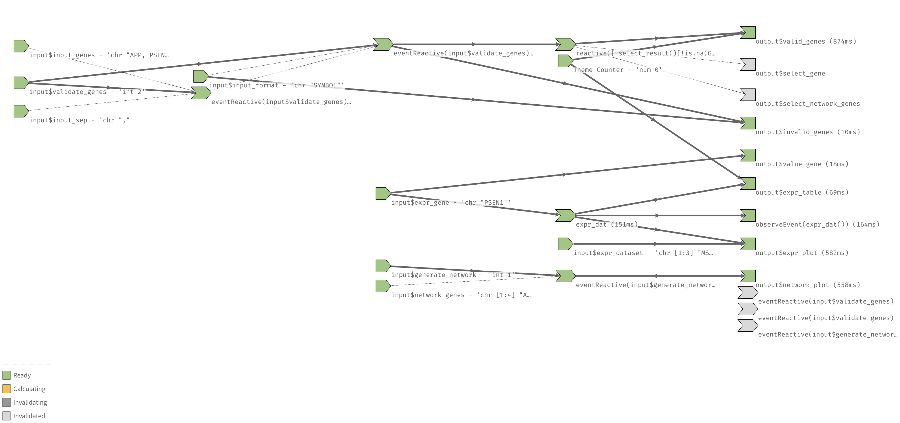
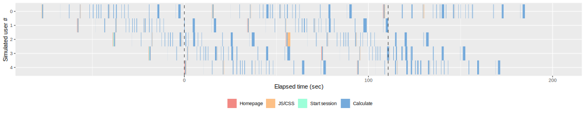

<p align="center">


</p>

# Design Summary

Alzheimer DataLENS is an [R Shiny](https://shiny.rstudio.com/) web
application with an HTML/CSS/JavaScript front-end, an R back-end, and a
[MongoDB](https://www.mongodb.com/) database. Details about the mission
and purpose of DataLENS are provided in `README.md`. Briefly, DataLENS
is an open data analysis platform which aims to advance Alzheimer’s
disease research by enabling the analysis, visualization, and sharing of
-omics data, where -omics refers to the branch of science concerned with
quantifying the levels of biological molecules.

# User Interface

The file `ui.R` defines the user interface (UI) of the application,
using a `shinydashboard` foundation supplemented by custom CSS defined
in `www/css/custom.css`. I also employ various R objects from the
`htmltools` package which represent HTML tags (see
`?htmltools::builder`) and use the `tags$zzz` syntax to prevent
namespace conflicts. I aimed to design the UI, color scheme, and
DataLENS logo as modern yet minimalist, and include various icons from
[FontAwesome](https://fontawesome.com/) to guide the user through the
web application.

# Shiny Reactivity

The foundation of the DataLENS back-end is R Shiny, a framework for
building web applications using the R programming language and
statistical computing environment. I selected R as my programming
language of choice due to the predominance of R in the domain of -omics
analysis and the availability of various key packages (i.e., libraries)
designed for biological datasets which enabled me to assemble
state-of-the-art bioinformatics pipelines.

Next, I decided to use Shiny since the interactivity which Shiny
facilitates allowed me to help non-technical audiences interpret
complex, multi-dimensional -omics datasets and permit users to perform
advanced R analyses with ease. Further, Shiny is designed on principles
of reactive programming, a declarative programming paradigm concerned
with managing interaction flows and the propagation of change to deliver
the fastest and most streamlined experience for the end-user. Given the
large size of my database (&gt; 20 Gb) and complexity of -omics data,
optimizing the application for speed (perhaps at the expense of memory
required) was critical. In particular, upon registering a change to a
user input, Shiny determines which outputs are relevant (i.e., depend on
the value of that input) and selectively modifies only those outputs,
thereby minimizing the work required.

When writing the back-end code for DataLENS in `server.R`, I maximized
the reactivity of Shiny by considering the reactive graph, which is the
data model that connects reactive inputs, reactive expressions, and
reactive outputs (i.e., reactive producers and reactive consumers). In
particular, I used the `reactlog()` functionality to visualize reactive
dependencies in a specific instance of Alzheimer DataLENS. The resulting
reactive graph is shown below:



As demonstrated above, upon user interaction, Shiny will only update
outputs downstream of that input in the reactive graph. Some features of
the back-end code which increase performance and mitigate errors
include:

-   Multiple `validate()` statements which validate user input on the
    server side, and prompt the user to correct the input if needed.

-   Use of the `observeEvent()` function with an `actionButton()` for
    event handling to delay modifying the reactive graph until a
    specific user action is completed, thereby minimizing database
    queries or API calls (e.g., minimizing POST requests to the STRING
    API, since requests are not made until the user clicks
    `Generate Network` or `Update Network`).

-   Use of `data.tables`, which support fast data wrangling operations
    including merging and sorting (see
    [here](https://www.rdocumentation.org/packages/data.table/versions/1.14.2)),
    after database queries with `mongolite`, as well as pipes (i.e.,
    `%>%`) from `magrittr` for code readability.

To learn more about R Shiny, please see the book *Mastering Shiny* by
Hadley Wickham, available [here](https://mastering-shiny.org/).

# MongoDB Database

I selected MongoDB as my database service (which is a NoSQL database, in
contrast to a SQL database such as SQL Server or SQLite) since it
supports multi-dimensional data types such as documents or arrays. These
values are stored in a `JSON`-like format. As MongoDB is not a
relational database, more performant indexing (as compared to SQL)
allows for high-throughput queries (e.g., querying large -omics
datasets).

When working with my database at the MongoDB Shell, I defined various
indices to support efficient query execution rather than a collection
scan (see documentation
[here](https://docs.mongodb.com/manual/indexes/)). Specifically, in the
`expression` collection (where collections are analogous to SQL tables),
I defined indices on the `GeneSymbol` and `FileName` columns which
dramatically improved the time required per query.

# Interfacing with External Services

Various components of Alzheimer DataLENS interface with external
services, components, or resources, including those listed below:

1.  Queries to the MongoDB database are handled by `mongolite` functions
    after the connections is established upon initial execution of
    `server.R`.
2.  Gene validation is performed using the `org.Hs.eg.db` genome wide
    human annotation, which depends on Entrez identifier mappings.
3.  Protein-protein interaction network analysis is performed using the
    STRING database (version 11). Specifically, the construction of each
    network is facilitated by a POST request made to the STRING
    application programming interface (API). STRING is a database of
    known and predicted protein-protein interactions.
4.  Brain segmentation plots are created via the `ggseg` package, which
    in turn relies on the Desikan-Killany cortical atlas and the
    automatic subcortical segmentation atlas. The manually-constructed
    mapping between DataLENS brain region identifiers and `ggseg`
    identifiers (derived from Freesurfer parcellations, etc.) is
    provided at `www/assets/ggseg_mapping.xlsx`.

Finally, I thank the original providers of the data contained in the
DataLENS database.

# Dependencies

The rationale for the inclusion of each required package is given below.

| Package          | Rationale                                                                                                                                                                     |
|------------------|-------------------------------------------------------------------------------------------------------------------------------------------------------------------------------|
| `shiny`          | Framework for web application development in R.                                                                                                                               |
| `shinydashboard` | Dashboard infrastructure for Shiny, see [here](http://rstudio.github.io/shinydashboard/).                                                                                     |
| `mongolite`      | Interface to MongoDB.                                                                                                                                                         |
| `AnnotationDbi`  | Implements the base class for all Bioconductor annotation packages that contains a database connection. Specifically, `select()` allows translation between gene identifiers. |
| `org.Hs.eg.db`   | The latest human genome annotation from Bioconductor.                                                                                                                         |
| `httr`           | To make `POST` requests to the STRING database.                                                                                                                               |
| `data.table`     | Fast and memory efficient data frames in R.                                                                                                                                   |
| `purrr`          | Functional programming tools, including and especially various iterable functions.                                                                                            |
| `magrittr`       | Implements the pipe operator, `%>%`.                                                                                                                                          |
| `ggplot2`        | Flexible declarative framework for data visualization in R based on The Grammar of Graphics.                                                                                  |
| `plotly`         | Converting `ggplot2` graphics to interactive, web-based versions via `ggplotly()`.                                                                                            |
| `DT`             | Wrapper to the JavaScript library `DataTables`.                                                                                                                               |
| `ggseg`          | Brain segmentation plots in R.                                                                                                                                                |
| `igraph`         | Network analysis in R.                                                                                                                                                        |
| `ggraph`         | `ggplot2`-based network visualization in R.                                                                                                                                   |
| `ggiraph`        | Converting `ggplot2` graphics to interactive, web-based versions; also allows the selection of graphical elements in Shiny.                                                   |

# Load Testing

Finally, I load tested the application using the `shinyloadtest` package
and the accompanying `shinycannon` command line tool to determine how
many users DataLENS can support and identify performance bottlenecks.

1.  First, I recorded a typical user session using `record_session()`.

    ``` r
    shinyloadtest::record_session('http://127.0.0.1:3704')
    ```

2.  I then used the `shinycannon` command line tool to replay the
    recording in parallel, simulating many simultaneous users accessing
    DataLENS.

    ``` bash
    java -jar shinycannon-1.1.0-45731f0.jar recording.log http://127.0.0.1:3704 --workers 5 --loaded-duration-minutes 2 --output-dir run
    ```

3.  Finally, I analyzed the load test logs to generate a load test
    report.

    ``` r
    df = shinyloadtest::load_runs("run")
    shinyloadtest::shinyloadtest_report(df, "load_test.html")
    ```

The load test report is provided in full at `www/assets/load_test.html`.
Below, I excerpt the report to show five simulated users executing
back-to-back sessions:



Note that the narrow event bars suggest that DataLENS is performant
under high-demand conditions.

To learn more about Shiny load testing, please see the [`shinyloadtest`
documentation](https://rstudio.github.io/shinyloadtest/).
