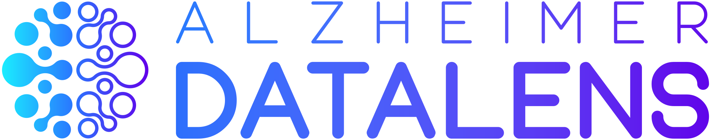

# About DataLENS

<!-- badges: start -->


<!-- badges: end -->

Alzheimer DataLENS is an open data analysis platform which aims to
advance Alzheimer’s disease (AD; see *About Alzheimer’s Disease* below)
research by enabling the analysis, visualization, and sharing of -omics
data. DataLENS houses bioinformatics pipelines for the analysis of
-omics data on Alzheimer’s disease and related dementias (ADRD) as well
as streamlined web interfaces which allow neuroscientists to browse and
query the results of these analyses. Note that -omics refers to the
branch of science concerned with quantifying the levels of biological
molecules (e.g., RNAs, proteins, etc.), and encompasses genomics,
transcriptomics, proteomics, metabolomics, metagenomics, etc.

There are currently over 50 genetic, proteomics, and transcriptomics
studies included in the DataLENS database, most of which are already
available to analyze and explore:

**Gene Expression Data**

1.  Analysis of 60 human microarray expression profiling datasets across
    various neurodegenerative diseases (26 Alzheimer’s, 21 Lewy body
    dementia, 13 amyotrophic lateral sclerosis and frontotemporal
    dementia).
2.  Analysis of 30+ public human datasets spanning 19 brain regions and
    5 cohorts.
3.  Analysis of data from several Alzheimer’s disease animal models.
4.  Three single-cell RNA-sequencing datasets.

**Proteomics Data**

1.  Analysis of two proteomics studies, with additional studies
    currently in progress.

**Genome-Wide Association Studies (GWAS)**

1.  Results from the International Genomics of Alzheimer’s Project
    (IGAP) GWAS meta-analysis.
2.  Results from the Accelerating Medicines Partnership – Alzheimer’s
    Disease (AMP-AD) GWAS study.

**Pathway Analysis**

1.  Protein-protein interaction data and integration of expression,
    epigenetic, and genetic data.

# Installation

DataLENS is an [R Shiny](https://shiny.rstudio.com/) web application
with an HTML/CSS/JavaScript front-end, an R back-end, and a
[MongoDB](https://www.mongodb.com/) database.

## Development

To install the development version of DataLENS, please complete the
following steps:

1.  Install the open-source R programming language and statistical
    computing environment, available [here](https://www.r-project.org/).
    DataLENS has been tested with R version 4.1.1 (2021-08-10, “Kick
    Things”) on Windows 10 (x86\_64-w64-mingw32/x64).
2.  Install the RStudio integrated development environment (IDE),
    available [here](https://www.rstudio.com/).

Next, please install the required dependencies in R:

| Package          | Version      |
|------------------|--------------|
| `shiny`          | &gt;= 1.7.1  |
| `shinydashboard` | &gt;= 0.7.1  |
| `mongolite`      | &gt;= 2.4.1  |
| `AnnotationDbi`  | &gt;= 1.54.0 |
| `org.Hs.eg.db`   | &gt;= 3.13.0 |
| `httr`           | &gt;= 1.4.2  |
| `data.table`     | &gt;= 1.14.0 |
| `purrr`          | &gt;= 0.3.4  |
| `magrittr`       | &gt;= 2.0.1  |
| `ggplot2`        | &gt;= 3.3.5  |
| `plotly`         | &gt;= 4.9.3  |
| `DT`             | &gt;= 0.20   |
| `ggseg`          | &gt;= 1.6.4  |
| `igraph`         | &gt;= 1.2.6  |
| `ggraph`         | &gt;= 2.0.5  |
| `ggiraph`        | &gt;= 0.7.10 |

Most packages can be installed from [The Comprehensive R Archive Network
(CRAN)](https://cran.r-project.org/) as follows:

``` r
install.packages("<package-name>")
```

Multiple packages can also be installed simultaneously; see
`?install.packages()` for more information.

The
[`AnnotationDbi`](https://bioconductor.org/packages/release/bioc/html/AnnotationDbi.html)
and
[`org.Hs.eg.db`](https://www.bioconductor.org/packages/release/data/annotation/html/org.Hs.eg.db.html)
packages are available from the
[*Bioconductor*](https://bioconductor.org/) project. To get the latest
release of Bioconductor followed by these packages, please run the
following:

``` r
# install Bioconductor
if (!require("BiocManager", quietly = TRUE))
    install.packages("BiocManager")
BiocManager::install(version = "3.14")

# install packages
BiocManager::install("AnnotationDbi")
BiocManager::install("org.Hs.eg.db")
```

## MongoDB Installation and Database Import

DataLENS employs a [MongoDB](https://www.mongodb.com/) back-end
database. Note that the following steps assume a Windows operating
system; however, analogous instructions for macOS or Linux can be found
[here](https://docs.mongodb.com/manual/installation/).

### Installation

To install MongoDB locally, please download MongoDB 5.0 Community
Edition, available
[here](https://docs.mongodb.com/manual/installation/). Follow the steps
provided by the MongoDB Installer wizard. For production on a remote
server, it is recommended to install MongoDB as a Windows service (i.e.,
an application that runs in the system’s background; see
[here](https://stackoverflow.com/questions/52068925/what-does-it-mean-to-install-mongodb-as-a-service)).
For development, it may be preferred to just install the binaries;
however, note that a MongoDB instance will have to be manually launched
each time DataLENS is run.

It may also be advantageous to install [MongoDB
Compass](https://www.mongodb.com/products/compass) (i.e. the MongoDB
graphical user interface \[GUI\] which includes access to the embedded
MongoDB Shell, `mongosh`) and [MongoDB Database
Tools](https://www.mongodb.com/try/download/database-tools).

### Launching MongoDB

To start MongoDB, first locate the file path of the MongoDB daemon
(e.g., `C:\Program Files\MongoDB\Server\5.0\bin\mongod.exe`). Next, run
the executable in Windows Command Prompt:

``` bash
PS C:\Users\username> "C:\Program Files\MongoDB\Server\5.0\bin\mongod.exe"
```

Next, add the path to the `mongosh.exe` binary (i.e., the MongoDB Shell)
to the `PATH` environment variable, or specify the full path at the
command line. Launch the MongoDB Shell to connect to the MongoDB
instance, where `username` represents the username of the Windows user:

``` bash
PS C:\Users\username> "C:\Program Files\MongoDB\Server\5.0\bin\mongo.exe"
```

One can also connect to the MongoDB database via MongoDB Compass.
Connect to a local database by passing an empty value as the connection
string.

### Accessing DataLENS Data

Please note that the entire DataLENS database cannot be uploaded via
Gradescope due to large file size (&gt; 20 GB, unindexed) as well as
restrictions imposed by the Data Use Agreements (DUAs) of the source
institutions. However, I have made a subset of the data available via
DropBox (5.18 GBs)
[here](https://www.dropbox.com/sh/ndbry59ksb0ci3b/AADNMQXL0ryfU_g_guERbCaja?dl=0).

Please feel free to download these files locally for the purposes of
testing DataLENS (see Step 3 under *Data Import*). However, please *do
not* share or redistribute these files. The DropBox link will expire by
02/06/2022; please reach out to request a new link after this date.

### Data Import

To import the DataLENS database, please complete the following steps:

1.  First, show all existing MongoDB databases by running:

    ``` bash
    show dbs
    ```

    An analogous command, `show collections`, can be used to identify
    all collections (i.e., MongoDB analog to a SQL table) in a database.

2.  Switch the context to a non-existing `datalens` database:

    ``` bash
    use datalens
    ```

3.  Download the DataLENS database dump (in `.bson` format) to a local
    directory (e.g., `C:/Users/username/Downloads/datalens/`).

4.  To restore the DataLENS database, run the following at the Command
    Prompt (i.e., *not* in the MongoDB Shell) at the directory where the
    database tools are installed (e.g.,
    `C:\Program Files\MongoDB\Tools\100\bin`):

    ``` bash
    mongorestore -d datalens "C:/Users/username/Downloads/datalens/"
    ```

5.  If import was successful, running `show dbs` again in the MongoDB
    shell should reveal an additional database. Note that host name
    `localhost` and port `27017` are the default for local MongoDB
    connections.

## Launching DataLENS

After completing the above steps, you are ready to launch Alzheimer
DataLENS!

1.  First, download the CS50 final project submission files, or clone
    the DataLENS GitHub repository (access available upon request).
2.  Open the `datalens` R project in RStudio, then open `ui.R`, which
    defines the user interface, and `server.R`, which defines the
    back-end server logic.
3.  Load all the libraries specified in `server.R` (i.e., run lines
    8-30).
4.  Click `Run App` in the upper right side of the RStudio editor.
    Alternatively, run `shiny::runApp()` in the R console. This will
    launch an instance of Alzheimer DataLENS as a locally hosted Shiny
    application.
5.  To open DataLENS in a web browser, click `Open in Browser` or
    navigate to the local URL of the port where Shiny is listening on
    (e.g., <http://127.0.0.1:3704>).
6.  Interrupt R to stop the application by pressing `Ctrl + C`, `Esc`,
    or the red `STOP` icon.

## Deploying to Production

To deploy DataLENS in production mode, it is recommended to explore
open-source [Shiny
Server](https://www.rstudio.com/products/shiny/shiny-server/) hosted on
an [Amazon Web Services (AWS)](https://aws.amazon.com/) Elastic Compute
Cloud (EC2) instance with the cloud-native [MongoDB
Atlas](https://www.mongodb.com/atlas/database) service rather than a
local installation of MongoDB.

# Using DataLENS

To use Alzheimer DataLENS, please complete the following steps:

1.  Summary information about DataLENS and AD is provided on the *Home*
    tab.

2.  First, navigate to *Input Genes* and provide a list of genes to
    DataLENS. Then, validate the gene set using genome-wide human
    annotations to confirm that all identifiers are found. The following
    identifiers are accepted: HGNC symbol, Ensembl ID, ENTREZ ID, and
    UniProt ID. Descriptions and synonymous identifiers for validated
    genes will be displayed, along with a list of any invalid genes
    provided.

3.  Next, navigate to *Differential Expression Analysis*. Select a gene
    of interest (from the list of genes validated in *Input Genes*), and
    examine the records of differential expression analyses pertaining
    to that gene. Note that `logFC` represents the log2 of the
    fold-change (i.e., effect size, often between case and control, also
    known as the M-value), `P` represents the nominal p-value (i.e.,
    statistical significance), and `adj P` represents the p-value
    adjusted for multiple comparisons. The variable `t` represents the
    moderated t-statistic, or the ratio of the M-value to the standard
    error, while `Ave. Expr.` represents the average expression value
    for that gene. For additional information, please see the [*limma*
    package
    documentation](https://bioconductor.org/packages/release/bioc/html/limma.html).

    Next, select various datasets in the dropdown menu. Observe how the
    expression levels of this gene change across various datasets. The
    bar chart will dynamically update to display both effect size
    (logFC) and significance (p-value, as color) across datasets of
    interest. Hover over each record to display full details in a
    tooltip.

4.  In *Interaction Network*, select genes of interest. Investigate
    interactions between these genes in the cellular interactome,
    retrieved from the STRING database of known and predicted
    protein-protein interactions (PPIs). Nodes in the network are
    colored and scaled according to their differential expression
    \[i.e., color is logFC while size is -log10(p-value)\] in a dataset
    of choice. The weight of each edge represents the combined score
    (across gene neighborhood, gene fusion, phylogenetic profile,
    coexpression, experimental evidence, database records, and text
    mining) for interaction between two nodes. Note that the user must
    select `Update Network` before the graph will render.

5.  In *Regional Expression*, explore transcriptomic datasets across
    brain regions. Select brain region(s) of choice in the dropdown
    menu, and examine records for transcriptomic datasets corresponding
    to that brain region. Brain regions are also visualized in brain
    segmentation plots constructed using the Desikan-Killany cortical
    atlas and automatic subcortical segmentation atlas.

# Video

The brief video describing Alzheimer’s DataLENS is available via YouTube
at: .

# About Alzheimer’s Disease

Alzheimer’s disease (AD) is a progressive neurodegenerative disorder
which impairs memory and cognition, and for which there is currently no
effective treatment nor cure. The threat which AD poses to global public
health is underscored by the following:

-   More than 6 million Americans live with AD today; in the absence of
    research advances, this number is projected to rise to 13 million
    by 2050.

-   1 in 3 seniors will die with Alzheimer’s disease or a related
    dementia (ADRD), more than breast cancer and prostate cancer
    combined. Further, during the COVID-19 pandemic, isolation and
    neglect of the vulnerable elderly caused deaths from ADRD to rise by
    16%.

-   In 2021, ADRD will cost the U.S. economy $355 billion; by 2050, this
    cost could rise to $1.1 trillion. In addition, more than 11 million
    Americans provided 15.3 billion hours of unpaid care for people with
    ADRD in 2020 ― this labor is valued at nearly $257 billion.
    Importantly, these statistics fail to account for the emotional toll
    on families and caregivers.

**Source:** *Alzheimer’s Disease Facts and Figures*, Alzheimer’s
Association 2021

# Acknowledgements

Alzheimer DataLENS was created by [Ayush
Noori](mailto:anoori1@mgh.harvard.edu) for [CS50 at Harvard
College](https://cs50.harvard.edu/). DataLENS is an initiative of the
[MIND Data Science
Lab](https://www.massgeneral.org/neurology/research/mind-data-science-lab)
in the [MassGeneral Institute for Neurodegenerative Disease
(MIND)](https://www.massgeneral.org/neurology/mind/) at Massachusetts
General Hospital.

Unless otherwise indicated, all code submitted was authored by myself.
The DataLENS database was provided by the MIND Data Science Lab. The
DataLENS logo was adapted from a digital asset commercially licensed
from Envato Elements.

I thank Dr. Sudeshna Das, Zhaozhi Li, Rongxin Liu, and Emily Merrill for
their advice and support.

# Selected References

1.  Bihlmeyer, N. A. et al. Novel methods for integration and
    visualization of genomics and genetics data in Alzheimer’s disease.
    Alzheimers Dement 15, 788–798 (2019).

2.  Noori, A., Mezlini, A. M., Hyman, B. T., Serrano-Pozo, A. & Das, S.
    Systematic review and meta-analysis of human transcriptomics reveals
    neuroinflammation, deficient energy metabolism, and proteostasis
    failure across neurodegeneration. Neurobiology of Disease 149,
    105225 (2021).

3.  Noori, A., Mezlini, A. M., Hyman, B. T., Serrano-Pozo, A. & Das, S.
    Differential gene expression data from the human central nervous
    system across Alzheimer’s disease, Lewy body diseases, and the
    amyotrophic lateral sclerosis and frontotemporal dementia spectrum.
    Data Brief 35, 106863 (2021).

4.  Das, S., Li, Z., Noori, A., Hyman, B. T. & Serrano-Pozo, A.
    Meta-analysis of mouse transcriptomic studies supports a
    context-dependent astrocyte reaction in acute CNS injury versus
    neurodegeneration. Journal of Neuroinflammation 17, 227 (2020).
